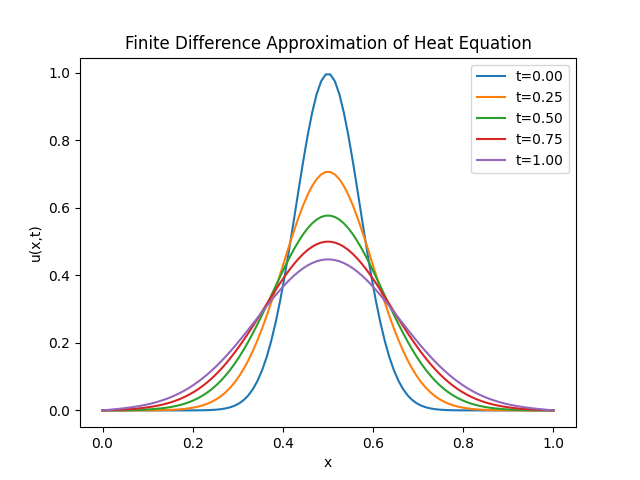

# Comparing a Finite Difference Approximation and a Neural Network Approximation of the 1-Dimensional Heat Equation

## Introduction

The 1-dimensional heat equation is a fundamental partial differential equation that models how heat diffuses through a single spatial dimension (rod). It describes how the temperature of a rod changes with respect to both position and time. In this project, we compare a finite difference approximation of the 1-dimensional heat equation to a simple neural network approximation of the 1-dimensional heat equation when given clear extreme temperature dynamics. In particular, the accuracy and error behaviour of the neural network are compared against the finite difference approximation to give us a better understanding of the effectiveness of a simple neural network approximation in this scenario.

This project was mainly inspired by the "Physics-Informed Neural Networks for Modelling Extreme Temperature Dynamics" EPSRC Vacation Internship supervised by Dr Vinny Davies at the University of Glasgow.

$$
\begin{equation}
0.004774843360605343
\nonumber
\end{equation}
$$

## Mathematical Theory

### The Forward Time Centred Space Scheme

Let $u(x,t)$ be the temperature of a rod depending on position $x$ and time $t$, then the 1-dimensional heat equation is given by

$$
\begin{align}
    \frac{\partial u}{\partial t}=\alpha\frac{\partial^2u}{\partial x^2},
\end{align}
$$

where $\alpha$ is the thermal diffusivity of the rod. In this project, we model how heat diffuses through a rod of length $L=1.0m$ in time $T=1.0s$ so $x,t\in[0,1]$. The boundary conditions at each end of the rod are given by

$$
\begin{align}
    u(0,t)=u(1,t)=0.
    \nonumber
\end{align}
$$

Since we are modelling extreme temperature dynamics, the initial condition was chosen to be

$$
\begin{align}
    u(x,0)=\exp\left(-100\left(x-0.5\right)^2\right),
    \nonumber
\end{align}
$$

which represents sudden extreme temperature at time $t=0.5s$. Let

$$
\begin{align}
    x_i&=i\Delta x,&&i=0,1,\dots,100,
    \nonumber\\
    t_n&=n\Delta t,&&n=0,1,\dots,1000,
    \nonumber
\end{align}
$$

and introduce the notation

$$
\begin{align}
    u_i^n\approx u(x_i,t_n),
    \nonumber
\end{align}
$$

then

$$
\begin{align}
    \frac{\partial u}{\partial t}&\approx\frac{u_i^{n+1}-u_i^n}{\Delta t},
    \nonumber\\
    \frac{\partial^2u}{\partial x^2}&\approx\frac{u_{i+1}^n-2u_i^n+u_{i-1}^n}{\left(\Delta x\right)^2}.
    \nonumber
\end{align}
$$

Substituting this into the 1-dimensional heat equation gives

$$
\begin{align}
    \frac{\partial u}{\partial t}=\alpha\frac{\partial^2u}{\partial x^2}&&\iff&&\frac{u_i^{n+1}-u_i^n}{\Delta t}=\alpha\frac{u_{i+1}^n-2u_i^n+u_{i-1}^n}{\left(\Delta x\right)^2}&&\iff&&u_i^{n+1}=u_i^n+r\left(u_{i+1}^n-2u_i^n+u_{i-1}^n\right),&&r=\frac{\alpha\Delta t}{\left(\Delta x\right)^2},
    \nonumber
\end{align}
$$

where $r$ is the diffusion number. For this solution to remain stable and not oscillate or diverge, $r$ must satisfy the following condition

$$
\begin{align}
    r\le0.5,
    \nonumber
\end{align}
$$

so the thermal diffusivity $\alpha=0.01$ was chosen to ensure stability. 

We now have a finite difference approximation, by the forward time centred space scheme, of the temperature $u_i^{n+1}$ of the rod at position $x_i$ and time $t_{n+1}$.

### The Feedforward Neural Network

A feedforward neural network was used to approximate the solution of the heat equation through the mapping

$$
\begin{align}
    (x,t)\rightarrow u(x,t),
    \nonumber
\end{align}
$$

where the values $(x,t)$ are from the finite difference approximation data. Each network layer applied a linear transformation followed by a hyperbolic tangent activation function due to its smooth nonlinear behaviour. The network parameters were optimised by minimising the mean square error loss function given by

$$
\begin{align}
    MSE=\frac{1}{100000}\sum_{i=1}^{100}\sum_{j=1}^{1000}\left(u_{i,j}-\hat{u}_{i,j}\right)^2,
    \nonumber
\end{align}
$$

using the Adam optimisation algorithm.

We now have a neural network approximation of the temperature $u$ of the rod at position $x$ and time $t$.

## Analysis of Results

A graph of temperature $u(x,t)$ against position $x$ created by the finite difference approximation of the 1-dimensional heat equation can be seen below.

We can see stable and realistic solutions of the heat equation, showing the gradual diffusion of the sudden extreme temperature over time. The peak widened and decreased as heat diffused through the rod from $u\approx1.0$ to $u\approx0.4$.
